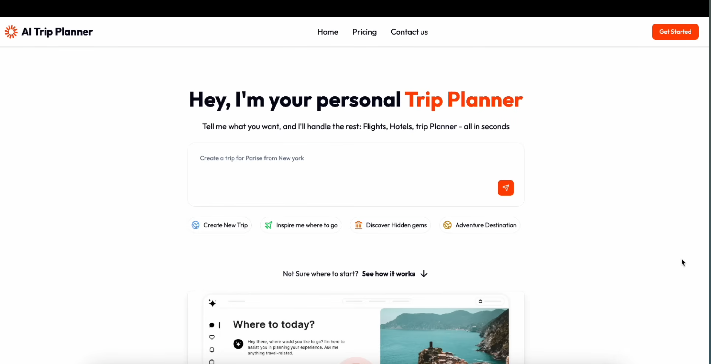
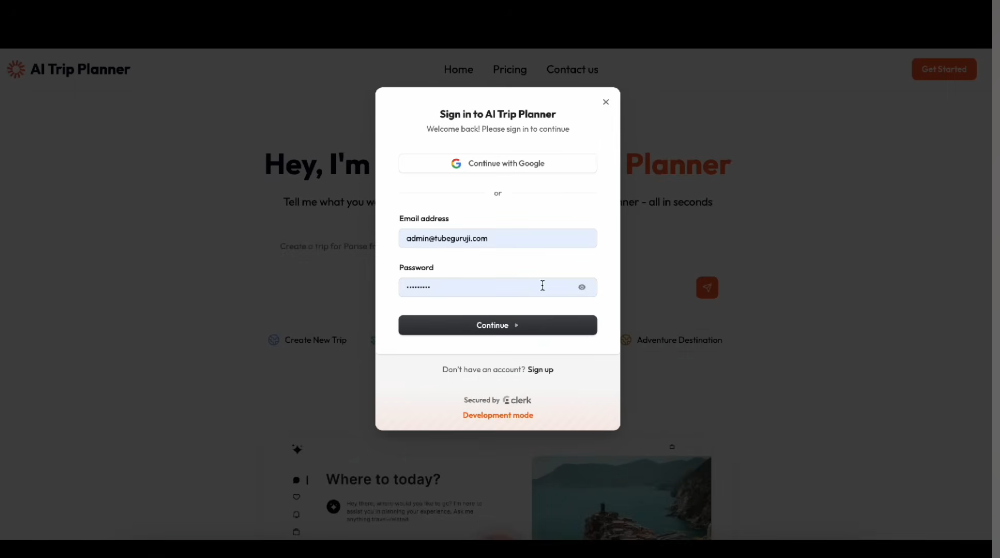
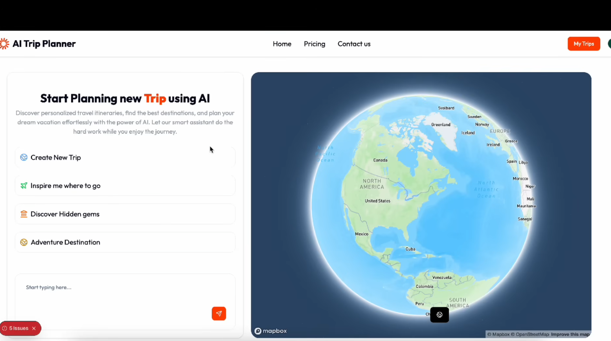
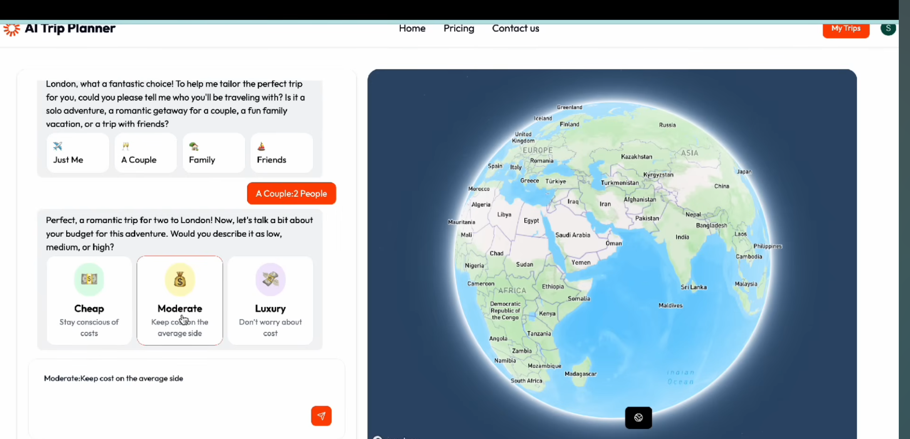
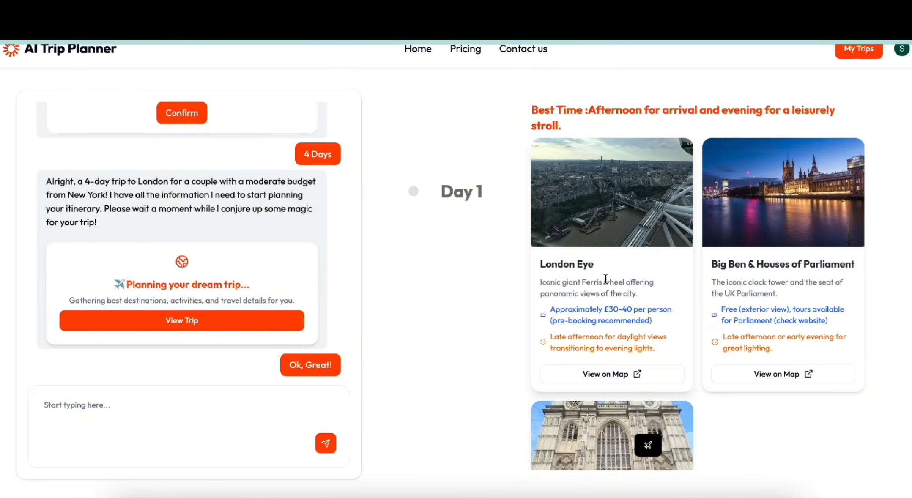
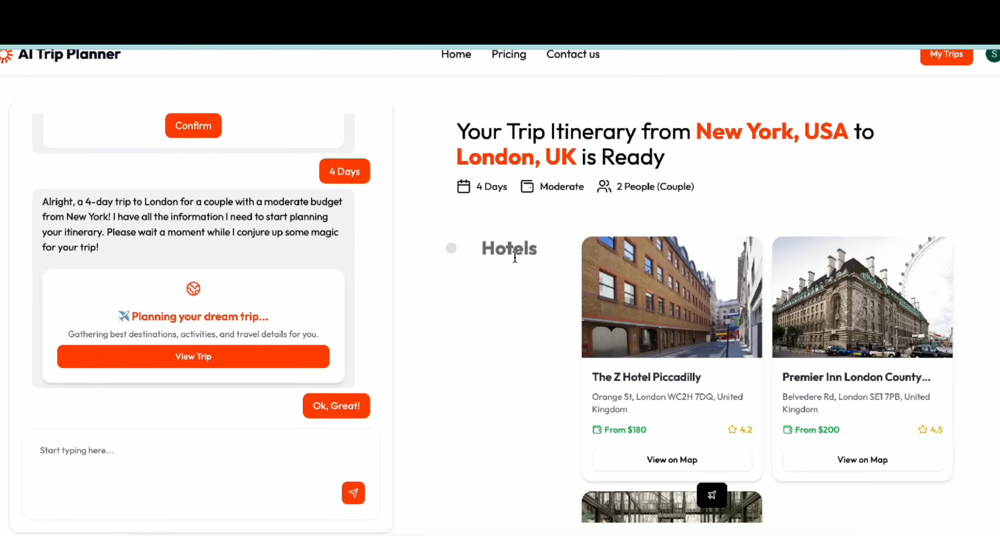
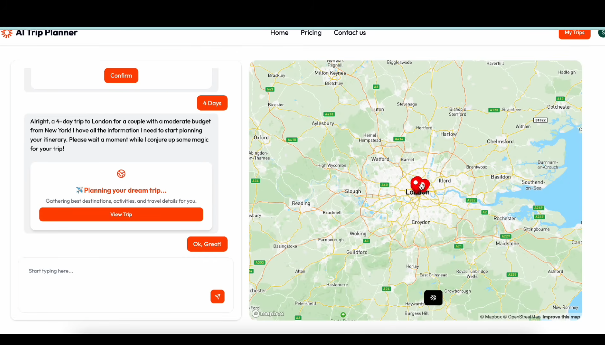

# ✈️ AI Trip Planner

> A full-stack AI-powered travel planning application that generates personalized, day-by-day trip itineraries with interactive 3D maps, hotel suggestions, and flight booking — all in one place.

---

## 📌 Problem Statement

Traditional travel planning is **time-consuming, confusing, and exhausting**. Users have to visit multiple websites to search for hotels, plan daily activities, check ticket prices, and track locations on maps — all without any personalized guidance.

**AI Trip Planner** solves this by acting as an automated AI travel agent. Based on the user's budget, trip duration, group size, and destination preferences, it instantly generates a **complete, interactive, and personalized day-by-day travel itinerary**.

---

## ✨ Features

- 🔐 **Secure Authentication** — Sign up / Sign in with full security via **Clerk Auth**
- 🤖 **AI Chat Interface** — Conversational AI collects trip details (destination, budget, group size, days)
- 🗺️ **Day-by-Day Itinerary** — AI generates a complete travel plan with places to visit each day
- 🏨 **Hotel Suggestions** — Smart hotel recommendations based on preferences and budget
- ✈️ **Flight Booking** — International flight booking support
- 🌍 **Interactive 3D Globe & Maps** — Visual route planning with Google 3D maps and navigation
- 💳 **Pricing & Usage Limits** — Subscription-based model with usage limits via **Clerk Billing**
- 🛡️ **Bot Protection & Rate Limiting** — Secured with **Arcjet** middleware
- 📱 **Responsive UI** — Clean, modern design with **Shadcn UI** and **Tailwind CSS**

---

## 📸 Project Screenshots

## 🏠 Home Page



## 🔐 Sign In



## 🤖 AI ChatBox


## 🤖 AI Chat




## 📅 Generated Itinerary



## 🗺️ Interactive Map



## 🛠️ Tech Stack

| Category | Technology |
|---|---|
| **Frontend** | Next.js 15+, React, TypeScript |
| **Styling** | Tailwind CSS, Shadcn UI |
| **Backend / Database** | Convex DB (Real-time, Zero-Config) |
| **Authentication** | Clerk Auth |
| **Billing** | Clerk Billing (Stripe Integration) |
| **AI Model** | OpenAI API |
| **Maps** | Interactive Maps / 3D Globe |
| **Security** | Arcjet (Bot Protection & Rate Limiting) |

---

## 🔑 Key Technical Insights

- **Next.js 15+ & TypeScript** — Frontend structure with full type-safety
- **Convex DB** — Zero-config real-time backend with schema enforcement
- **Generative UI** — Interactive AI chat components for dynamic user experience
- **OpenAI API** — Core engine for itinerary generation via structured prompting
- **Arcjet Security** — IP-based bot protection and rate limiting at middleware level
- **Clerk Billing** — Single-line Stripe integration for premium feature paywall
- **3D Globe & Interactive Maps** — Visual data mapping for trip routes
- **Shadcn UI & Tailwind CSS** — Responsive and modern component design

---

## ⚙️ Development Methodology

### 1. Project Initialization
- Scaffolded with `npx create-next-app@latest` using Next.js 15 + TypeScript
- UI configured with `npx shadcn-ui@latest init` and Tailwind CSS

### 2. Authentication & Authorization
- Clerk middleware integrated at root level to protect routes (Dashboard, Trip Output)
- Client-side and server-side session management using Clerk's built-in hooks

### 3. Real-time Backend & Data Modeling
- Convex **mutations** for saving data and **queries** for fetching data
- Strict schema enforcement via `schema.ts` for tables like `users` and `trips`

### 4. AI Itinerary Generation
- Structured prompting: user inputs (Destination, Budget, Days) → precise JSON prompt → AI output
- JSON response parsed and mapped to frontend design cards

### 5. Security & Monetization
- Arcjet rate-limiting at middleware level based on user IP
- Clerk Billing + Stripe webhooks to lock premium features behind paywall

---

## 🏃 How to Run

### 1. Clone the Repository
```bash
git clone https://github.com/your-username/ai-trip-planner.git
cd ai-trip-planner
```

### 2. Install Dependencies
```bash
npm install
```

### 3. Setup Environment Variables
Create a `.env.local` file in the root directory and add the following:
```env
# Clerk Auth
NEXT_PUBLIC_CLERK_PUBLISHABLE_KEY=your_clerk_publishable_key
CLERK_SECRET_KEY=your_clerk_secret_key

# Convex
NEXT_PUBLIC_CONVEX_URL=your_convex_url

# OpenAI
OPENAI_API_KEY=your_openai_api_key

# Arcjet
ARCJET_KEY=your_arcjet_key
```

### 4. Start Convex Backend
```bash
npx convex dev
```

### 5. Run the Project
```bash
npm run dev
```

Open [http://localhost:3000](http://localhost:3000) in your browser.

---

## 📊 Results & Conclusion

| Outcome | Description |
|---|---|
| ✅ Real-time AI Travel Agent | Instant itinerary generation via OpenAI |
| ✅ Interactive Data Visualization | 3D Globe & Maps for route visualization |
| ✅ Secured Commercial Product | Arcjet + Clerk Auth for full security |
| ✅ Monetization Ready | Clerk Billing with Stripe for premium features |

---

## 🔮 Future Work

1. **Real-time Booking Integration** — Flights & hotels via Skyscanner / Booking.com API
2. **Multi-user Collaboration** — Group trip planning with shared itineraries
3. **Expense Tracker** — Budget management with Splitwise-like feature
4. **Advanced AI Personalization & Voice Assistant** — Voice command support
5. **Offline Access & PDF Export** — Progressive Web App (PWA) with PDF download

---

## 👩‍💻 Author

**Taniya Chandra**


